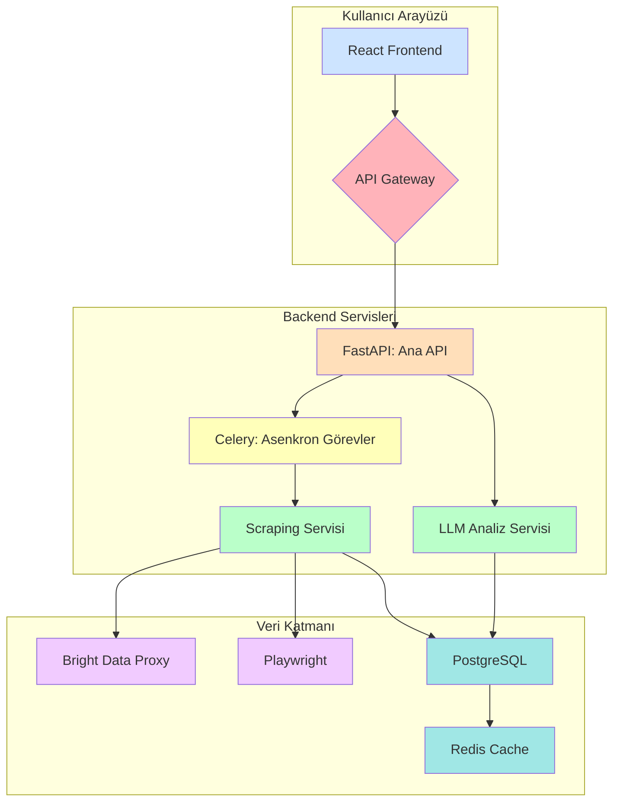

_# Proje Planı: Pazaryeri Veri Analiz Platformu

**Doküman:** 02 - Faz 1 Detaylı Teknik Tasarım ve Mimari
**Tarih:** 10 Aralık 2025
**Versiyon:** 1.0

---

## 1. Sistem Mimarisi

Faz 1 için önerilen sistem mimarisi, ölçeklenebilir, modüler ve bakımı kolay bir yapıya sahip olan **mikroservis odaklı bir yaklaşımdır**. Sistem, üç ana katmandan oluşacaktır:

1.  **Sunum Katmanı (Frontend):** Kullanıcının etkileşimde bulunduğu web arayüzü.
2.  **Uygulama Katmanı (Backend):** İş mantığının, API'lerin ve servislerin bulunduğu katman.
3.  **Veri Katmanı (Data Layer):** Verilerin depolandığı, işlendiği ve yönetildiği katman.

### Mimari Bileşenleri

-   **React Frontend:** Kullanıcı arayüzü için modern ve reaktif bir kütüphane.
-   **API Gateway:** Gelen istekleri ilgili servise yönlendiren ve güvenliği sağlayan katman (Örn: Nginx, Traefik).
-   **FastAPI (Ana API):** Yüksek performanslı, asenkron Python web framework'ü. Ana iş mantığı burada yer alacak.
-   **Celery (Asenkron Görevler):** Uzun süren scraping ve analiz işlemlerini arka planda çalıştırmak için görev kuyruğu.
-   **Scraping Servisi:** Bright Data ve Playwright kullanarak pazaryerlerinden veri çeken servis.
-   **LLM Analiz Servisi:** OpenAI/Gemini API'sini kullanarak yüklenen CSV/Excel dosyalarını analiz eden ve öneriler sunan servis.
-   **Bright Data:** Pazaryerlerinin bot korumalarını aşmak için kullanılan proxy servisi.
-   **Playwright:** Web sayfalarını otomatize etmek ve dinamik içerikleri çekmek için kullanılan tarayıcı otomasyon aracı.
-   **PostgreSQL:** Ana veri tabanı. Ürünler, satıcılar ve zaman serisi verileri burada saklanacak.
-   **Redis:** Tekrar eden verileri önlemek (duplicate detection) ve sık kullanılan verileri önbelleğe almak için.

## 2. Teknoloji Stack (Yığını)

| Katman | Teknoloji | Gerekçe |
| :--- | :--- | :--- |
| **Frontend** | React, TypeScript, TailwindCSS | Hızlı geliştirme, tip güvenliği, modern ve esnek stil altyapısı. |
| **Backend** | Python, FastAPI, Celery | Yüksek performans, asenkron yetenekler, Python'un veri bilimi ekosistemi. |
| **Web Scraping** | Bright Data, Playwright, BeautifulSoup | Güvenilir proxy, güçlü tarayıcı otomasyonu, esnek HTML ayrıştırma. |
| **Veritabanı** | PostgreSQL, Redis | Güçlü ilişkisel yapı, zaman serisi için partitioning desteği, hızlı önbellekleme. |
| **LLM Entegrasyonu**| OpenAI (GPT-4-Mini), LangChain | Yüksek kaliteli dil modeli, kolay entegrasyon ve prompt yönetimi. |
| **Deployment** | Docker, Docker Compose, Nginx | Konteynerleştirme ile taşınabilirlik, kolay kurulum ve yönetim. |

## 3. Veri Modeli (Database Schema)

Veri tabanı, ürünlerin statik bilgilerini ve zamanla değişen dinamik bilgilerini ayrı tablolarda tutacak şekilde tasarlanmıştır. Bu, hem veri bütünlüğünü sağlar hem de sorgu performansını artırır.

### `products` Tablosu (Statik Bilgiler)

Bu tablo, bir ürünün platformdaki temel ve değişmeyen bilgilerini saklar.

| Sütun Adı | Veri Tipi | Açıklama |
| :--- | :--- | :--- |
| `id` | `UUID` (PK) | Sisteme özel benzersiz ürün ID'si. |
| `platform` | `VARCHAR(20)` | Ürünün bulunduğu platform (hepsiburada, trendyol, amazon). |
| `external_id` | `VARCHAR(100)`| Platformun ürüne verdiği benzersiz ID. |
| `name` | `TEXT` | Ürünün tam adı. |
| `url` | `TEXT` | Ürünün pazaryerindeki URL'si. |
| `seller_name` | `VARCHAR(255)`| Ürünü satan satıcının adı. |
| `category_path` | `TEXT` | Ürünün tam kategori yolu (Örn: "Elektronik > Bilgisayar > Dizüstü Bilgisayar"). |
| `created_at` | `TIMESTAMP` | Ürünün sisteme ilk eklendiği zaman. |

### `product_snapshots` Tablosu (Dinamik, Zaman Serisi Veriler)

Bu tablo, bir ürünün zamanla değişen metriklerini günlük olarak saklar. **`snapshot_date`** sütununa göre aylık olarak bölümlenecektir (partitioning).

| Sütun Adı | Veri Tipi | Açıklama |
| :--- | :--- | :--- |
| `id` | `BIGSERIAL` (PK)| Snapshot kaydının benzersiz ID'si. |
| `product_id` | `UUID` (FK) | `products` tablosuna referans. |
| `price` | `DECIMAL(10, 2)`| Ürünün anlık satış fiyatı. |
| `rating` | `FLOAT` | Ürünün ortalama puanı (Örn: 4.7). |
| `reviews_count` | `INTEGER` | Toplam yorum sayısı. |
| `in_stock` | `BOOLEAN` | Ürünün stokta olup olmadığı. |
| `is_sponsored` | `BOOLEAN` | Ürünün arama sonuçlarında sponsorlu olarak çıkıp çıkmadığı. |
| `snapshot_date` | `DATE` | Bu verinin toplandığı tarih. |

## 4. Veri Akışı (Data Flow)

Kullanıcının bir anahtar kelime araması yapmasından verinin gösterilmesine kadar olan süreç aşağıdaki adımları izler:

1.  **İstek (Request):** Kullanıcı, React arayüzünden "boya koruma" kelimesini aratır. İstek, API Gateway üzerinden FastAPI backend'ine ulaşır.
2.  **Asenkron Görev Oluşturma:** FastAPI, bu uzun sürecek scraping işlemi için bir Celery görevi oluşturur ve kullanıcıya hemen bir "görev alındı" yanıtı döner.
3.  **Scraping Görevi:** Celery worker'ı görevi alır ve Scraping Servisi'ni tetikler.
    -   Scraping Servisi, Bright Data üzerinden bir proxy bağlantısı kurar.
    -   Playwright'ı bu proxy ile başlatır ve Hepsiburada'nın arama sonuçları sayfasını açar.
    -   Sayfadaki ilk 100 ürünün temel bilgilerini (URL, isim, sponsorlu durumu) çeker.
4.  **Veri İşleme ve Kaydetme:**
    -   Çekilen her ürün için:
        -   `products` tablosunda var olup olmadığı kontrol edilir. Yoksa yeni bir kayıt oluşturulur.
        -   `product_snapshots` tablosuna o güne ait fiyat, puan gibi dinamik veriler kaydedilir.
    -   Redis, aynı gün içinde aynı ürünün tekrar işlenmesini engellemek için kullanılır.
5.  **Sonuçların Sunulması:** Celery görevi tamamlandığında, sonuçlar (genellikle bir görev ID'si ile) veritabanına yazılır. Frontend, bu görev ID'si ile sonuçları periyodik olarak sorgular ve kullanıcıya gösterir.

Bu mimari, sistemin hem anlık isteklere hızlı yanıt vermesini sağlar hem de arka planda yoğun veri işleme görevlerini verimli bir şekilde yönetir._
