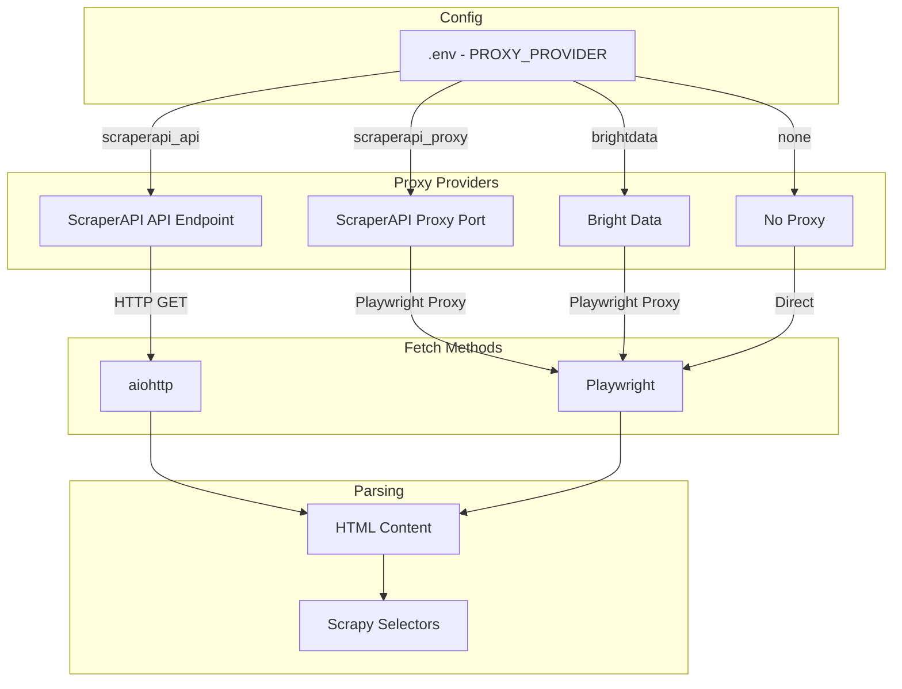

# Modular Scraping Architecture - Revised Plan v2

**Tarih:** 11 Aralık 2025
**Amaç:** ScraperAPI + Scrapy entegrasyonu ile modüler scraping altyapısı

---

## 1. Mevcut Plan Analizi

### ✅ İyi Yanları

| Özellik                    | Açıklama                                                                   |
| --------------------------- | ---------------------------------------------------------------------------- |
| **Modüler Tasarım** | Provider abstraction layer iyi düşünülmüş                              |
| **Manuel Kontrol**    | Otomatik seçim yerine `.env` ile manuel seçim - kullanıcı kontrolünde |
| **Factory Pattern**   | `ProxyProviderFactory` ile temiz provider oluşturma                       |
| **Maliyet Analizi**   | Bright Data vs ScraperAPI karşılaştırması detaylı                      |

### ❌ Kötü Yanları / Eksikleri (Düzeltildi)

| Sorun                                      | Çözüm                                                                |
| ------------------------------------------ | ----------------------------------------------------------------------- |
| **Parser Seçimi Gereksiz**          | ✅ Sadece Scrapy Selectors kullanılacak (BeautifulSoup kaldırılacak) |
| **Playwright + Proxy Çakışması** | ✅ İki farklı ScraperAPI metodu ayrı tutulacak                       |

---

## 2. Kritik Bulgu: ScraperAPI + Playwright

### ⚠️ Çakışma Durumu

**Dosya:** `ScraperAPI + Playwright Entegrasyon Notları.md`

> **"ÖNERİLMEYEN Yöntem: Proxy Mode"**
> ScraperAPI'nin proxy port'unu doğrudan Playwright'ın launch() seçeneklerinde kullanmak **başarısız olur**.

**Dosya:** `ScraperAPI Proxy Port Metodu.md`

> **Satır 104:** "Playwright Uyumluluğu: Proxy port metodu Playwright ile **uyumludur**"

### 🔍 Gerçek Durum

| Yöntem                | Playwright ile Uyumluluk | Açıklama                                       |
| ---------------------- | ------------------------ | ------------------------------------------------ |
| **API Endpoint** | ✅ Çalışır           | `page.goto(scraperapi_url)` doğrudan çağrı |
| **Proxy Port**   | ⚠️ Sorunlu             | SSL doğrulama, auth sorunları yaşanabilir     |

---

## 3. Revize Edilmiş Mimari



---

## 4. Yeni Provider Seçenekleri

### 4.1 ScraperAPI - API Endpoint Metodu (ÖNERİLEN)

**Ne Zaman Kullanılır:** Playwright'a ihtiyaç olmadığında, basit HTTP istekleri için

```python
class ScraperAPIEndpointProvider(BaseProxyProvider):
    """ScraperAPI API Endpoint - Playwright YOK, aiohttp ile"""
  
    async def get_page_content(self, url: str, render_js: bool = False) -> str:
        params = {"api_key": self.api_key, "url": url}
        if render_js:
            params["render"] = "true"
      
        async with aiohttp.ClientSession() as session:
            async with session.get(
                "http://api.scraperapi.com",
                params=params,
                timeout=70
            ) as response:
                return await response.text()
  
    def get_playwright_proxy_config(self) -> None:
        # Bu metod için Playwright kullanılmaz
        return None
```

**Avantajları:**

- Daha güvenilir
- SSL sorunları yok
- Test etmesi kolay

**Dezavantajları:**

- Playwright özellikleri (scroll, click) kullanılamaz
- Sadece statik HTML

---

### 4.2 ScraperAPI - Proxy Port Metodu

**Ne Zaman Kullanılır:** Playwright gerekliyse (scroll, dynamic content)

```python
class ScraperAPIProxyProvider(BaseProxyProvider):
    """ScraperAPI Proxy Port - Playwright ile"""
  
    def get_playwright_proxy_config(self) -> Dict:
        return {
            "server": "http://proxy-server.scraperapi.com:8001",
            "username": f"scraperapi.premium=true.country_code=tr",
            "password": self.api_key
        }
```

**Avantajları:**

- Playwright özellikleri kullanılabilir
- Mevcut kod yapısına uygun

**Dezavantajları:**

- SSL doğrulama sorunları olabilir
- `ignore_https_errors=True` zorunlu

---

### 4.3 Bright Data (Mevcut)

**Ne Zaman Kullanılır:** Zor siteler, captcha, gelişmiş bot koruması

```python
class BrightDataProvider(BaseProxyProvider):
    """Bright Data - En güvenilir ama pahalı"""
  
    def get_playwright_proxy_config(self) -> Dict:
        return {
            "server": "http://brd.superproxy.io:33335",
            "username": f"brd-customer-{self.account_id}-zone-{self.zone_name}",
            "password": self.zone_password
        }
```

---

## 5. Önerilen Strateji

| Senaryo                              | Provider                | Metod      | Maliyet  |
| ------------------------------------ | ----------------------- | ---------- | -------- |
| **İlk veri çekme**           | ScraperAPI API Endpoint | aiohttp    | Düşük |
| **Scroll gerektiren sayfalar** | ScraperAPI Proxy Port   | Playwright | Orta     |
| **Zor siteler (captcha)**      | Bright Data             | Playwright | Yüksek  |

---

## 6. Güncellenmiş Environment Variables

```bash
# .env

# Provider Seçimi (manuel)
PROXY_PROVIDER=scraperapi_api   # scraperapi_api | scraperapi_proxy | brightdata | none

# ScraperAPI
SCRAPERAPI_KEY=your_key

# Bright Data (opsiyonel)
BRIGHT_DATA_ACCOUNT_ID=hl_xxx
BRIGHT_DATA_ZONE_NAME=marketplace_scraper
BRIGHT_DATA_ZONE_PASSWORD=xxx
```

> **Not:** Parser seçimi yok - tüm parsing Scrapy Selectors ile yapılacak.

---

## 7. Dosya Yapısı

```
backend/app/services/
├── proxy_providers/
│   ├── __init__.py
│   ├── base.py                    # BaseProxyProvider ABC
│   ├── scraperapi_endpoint.py     # API Endpoint (aiohttp)
│   ├── scraperapi_proxy.py        # Proxy Port (Playwright)
│   ├── brightdata.py              # Bright Data (Playwright)
│   └── factory.py                 # ProxyProviderFactory
├── parsers/
│   ├── __init__.py
│   └── scrapy_parser.py           # Scrapy Selectors (BeautifulSoup yerine)
└── scraping.py                    # Refactored ScrapingService
```

---

## 8. Karar Noktaları

**Aşağıdaki kararları vermeniz gerekiyor:**

1. **ScraperAPI hangi metod?**

   - `scraperapi_api` (HTTP endpoint - daha güvenilir)
   - `scraperapi_proxy` (Proxy port - Playwright ile)
2. **Playwright gerçekten gerekli mi?**

   - Hepsiburada arama sonuçları için scroll gerekiyor mu?
   - Yoksa sadece HTML fetch yeterli mi?
