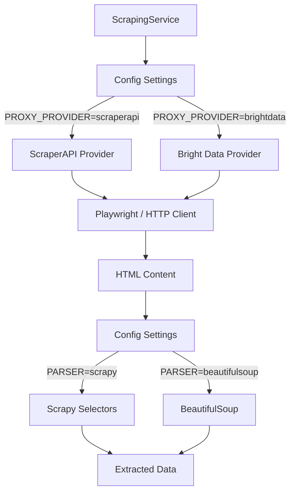

# Modular Scraping Architecture: Analysis & Implementation Plan

**Tarih:** 11 Aralık 2025  
**Amaç:** Mevcut scraping altyapısını modüler hale getirmek, maliyet optimizasyonu için ScraperAPI entegrasyonu ve Scrapy framework kullanımı planlamak.

---

## 1. Mevcut Durum Analizi

### 1.1 Bright Data Kullanım Noktaları

Aşağıdaki dosyalar Bright Data'ya özel kod içermektedir:

#### [config.py](file:///Users/projectx/Desktop/marketing_agent/backend/app/core/config.py)
```python
# Bright Data configuration (Lines 9-26)
BRIGHT_DATA_ACCOUNT_ID: str = os.getenv("BRIGHT_DATA_ACCOUNT_ID", "")
BRIGHT_DATA_ZONE_NAME: str = os.getenv("BRIGHT_DATA_ZONE_NAME", "")
BRIGHT_DATA_ZONE_PASSWORD: str = os.getenv("BRIGHT_DATA_ZONE_PASSWORD", "")

@property
def bright_data_proxy_config(self):
    # Bright Data specific proxy format
    return {
        "server": "http://brd.superproxy.io:33335",
        "username": f"brd-customer-{self.BRIGHT_DATA_ACCOUNT_ID}{zone_part}",
        "password": self.BRIGHT_DATA_ZONE_PASSWORD
    }
```

#### [scraping.py](file:///Users/projectx/Desktop/marketing_agent/backend/app/services/scraping.py)
| Satır | Kullanım | Açıklama |
|-------|----------|----------|
| 18 | `self.proxy_config = settings.bright_data_proxy_config` | Proxy config yükleme |
| 26-33 | Playwright proxy ayarları | Bright Data proxy ile browser başlatma |
| 35 | Fallback mesajı | "No Bright Data credentials" log |

### 1.2 HTML Parsing (BeautifulSoup Kullanımı)

Mevcut sistemde **BeautifulSoup** HTML parsing için kullanılıyor:

| Metod | Satır | Kullanım Amacı |
|-------|-------|----------------|
| `_get_product_urls_from_search` | 116 | Arama sonuçlarından ürün URL'lerini çıkarma |
| `scrape_product_detail_page` | 165 | Ürün detay sayfasını parse etme |
| `_extract_json_ld_data` | 220-238 | JSON-LD structured data çıkarma |
| `_extract_html_data` | 335-409 | Fiyat, stok, açıklama çıkarma |
| `_extract_other_sellers` | 411-452 | Diğer satıcı bilgilerini çıkarma |
| `_extract_reviews` | 454-478 | Yorum verilerini çıkarma |
| `_extract_coupons` | 480-502 | Kupon bilgilerini çıkarma |
| `_extract_campaigns` | 504-520 | Kampanya bilgilerini çıkarma |

---

## 2. Karşılaştırma: BeautifulSoup vs Scrapy Selectors

| Özellik | BeautifulSoup | Scrapy Selectors |
|---------|---------------|------------------|
| **XPath Desteği** | ❌ Yok | ✅ Tam destek |
| **CSS Selectors** | ✅ Var | ✅ Var (gelişmiş) |
| **Regex Desteği** | Manuel | ✅ Entegre (`re:` prefix) |
| **Performans** | Orta | Yüksek (lxml backend) |
| **Bellek Kullanımı** | Yüksek | Düşük |
| **Framework Entegrasyonu** | Bağımsız | Scrapy ecosystem |

> [!IMPORTANT]
> Scrapy Selectors, XPath ve CSS selectorlerini aynı anda destekler ve BeautifulSoup'a göre daha performanslıdır. Ancak **mevcut kodun çoğu BeautifulSoup-specific CSS selector kullanıyor**, bu nedenle geçiş planlı yapılmalı.

---

## 3. Proxy Provider Karşılaştırması

### 3.1 Bright Data vs ScraperAPI

| Özellik | Bright Data | ScraperAPI |
|---------|-------------|------------|
| **Fiyatlandırma** | ~$5-15/GB (Residential) | $49/100K requests (başlangıç) |
| **JavaScript Render** | ❌ Ayrı Browser API | ✅ `render=true` parametresi |
| **Geolocation** | ✅ Evet | ✅ `country_code` parametresi |
| **Anti-bot Bypass** | Gelişmiş | Orta-İyi |
| **Playwright Entegrasyonu** | ✅ Native proxy | ✅ Proxy mode |
| **API Endpoint** | ❌ | ✅ `api.scraperapi.com` |
| **Async Support** | ❌ | ✅ `async.scraperapi.com` |

### 3.2 Maliyet Senaryoları

```
Senaryo: 1000 ürün scraping

Bright Data (Residential):
- ~50KB per page x 1000 = 50MB
- Maliyet: ~$0.50-1.50

ScraperAPI (Hobby Plan - $49/mo):
- 100,000 API credits
- 1000 ürün = 1000 credit (render=false)
- 1000 ürün = 10,000 credit (render=true)
- Maliyet: Ayda $49 sabit
```

> [!TIP]
> **Önerilen Strateji:** Normal scraping için ScraperAPI, zorlu siteler (Captcha, gelişmiş bot koruması) için Bright Data.

---

## 4. Proposed Changes

### 4.1 Yeni Modüler Mimari



---

### 4.2 Dosya Değişiklikleri

#### [NEW] [proxy_providers/base.py](file:///Users/projectx/Desktop/marketing_agent/backend/app/services/proxy_providers/base.py)
Abstract base class for proxy providers.

```python
from abc import ABC, abstractmethod
from typing import Dict, Optional

class BaseProxyProvider(ABC):
    @abstractmethod
    async def get_page_content(self, url: str, render_js: bool = False) -> Optional[str]:
        """Fetch page content through proxy"""
        pass
    
    @abstractmethod
    def get_playwright_proxy_config(self) -> Optional[Dict]:
        """Get proxy config for Playwright"""
        pass
```

---

#### [NEW] [proxy_providers/scraperapi.py](file:///Users/projectx/Desktop/marketing_agent/backend/app/services/proxy_providers/scraperapi.py)
ScraperAPI implementation.

```python
import aiohttp
from urllib.parse import urlencode
from .base import BaseProxyProvider

class ScraperAPIProvider(BaseProxyProvider):
    API_ENDPOINT = "http://api.scraperapi.com"
    PROXY_HOST = "proxy-server.scraperapi.com"
    PROXY_PORT = 8001
    
    def __init__(self, api_key: str):
        self.api_key = api_key
    
    async def get_page_content(self, url: str, render_js: bool = False) -> Optional[str]:
        params = {
            "api_key": self.api_key,
            "url": url,
        }
        if render_js:
            params["render"] = "true"
        
        async with aiohttp.ClientSession() as session:
            async with session.get(
                self.API_ENDPOINT,
                params=params,
                timeout=aiohttp.ClientTimeout(total=70)
            ) as response:
                if response.status == 200:
                    return await response.text()
        return None
    
    def get_playwright_proxy_config(self) -> Dict:
        return {
            "server": f"http://{self.PROXY_HOST}:{self.PROXY_PORT}",
            "username": "scraperapi",
            "password": self.api_key
        }
```

---

#### [NEW] [proxy_providers/brightdata.py](file:///Users/projectx/Desktop/marketing_agent/backend/app/services/proxy_providers/brightdata.py)
Bright Data implementation (mevcut kodun refactor edilmiş hali).

```python
class BrightDataProvider(BaseProxyProvider):
    PROXY_HOST = "brd.superproxy.io"
    PROXY_PORT = 33335
    
    def __init__(self, account_id: str, zone_name: str, zone_password: str):
        self.account_id = account_id
        self.zone_name = zone_name
        self.zone_password = zone_password
    
    def get_playwright_proxy_config(self) -> Dict:
        zone_part = f"-zone-{self.zone_name}" if self.zone_name else ""
        return {
            "server": f"http://{self.PROXY_HOST}:{self.PROXY_PORT}",
            "username": f"brd-customer-{self.account_id}{zone_part}",
            "password": self.zone_password
        }
```

---

#### [NEW] [proxy_providers/factory.py](file:///Users/projectx/Desktop/marketing_agent/backend/app/services/proxy_providers/factory.py)
Simple factory to create provider based on config.

```python
from typing import Optional
from .base import BaseProxyProvider
from .scraperapi import ScraperAPIProvider
from .brightdata import BrightDataProvider
from app.core.config import settings

class ProxyProviderFactory:
    """Config'e göre provider oluşturur - otomatik seçim YOK"""
    
    @staticmethod
    def create() -> Optional[BaseProxyProvider]:
        provider_type = settings.PROXY_PROVIDER  # "scraperapi" veya "brightdata"
        
        if provider_type == "scraperapi":
            return ScraperAPIProvider(api_key=settings.SCRAPERAPI_KEY)
        elif provider_type == "brightdata":
            return BrightDataProvider(
                account_id=settings.BRIGHT_DATA_ACCOUNT_ID,
                zone_name=settings.BRIGHT_DATA_ZONE_NAME,
                zone_password=settings.BRIGHT_DATA_ZONE_PASSWORD
            )
        else:
            return None  # No proxy
```

---

#### [NEW] [parsers/scrapy_parser.py](file:///Users/projectx/Desktop/marketing_agent/backend/app/services/parsers/scrapy_parser.py)
Scrapy Selectors wrapper for HTML parsing.

```python
from scrapy import Selector
from typing import Dict, Any, List, Optional

class ScrapyHTMLParser:
    """Scrapy Selectors kullanarak HTML parsing"""
    
    def __init__(self, html_content: str):
        self.selector = Selector(text=html_content)
    
    def extract_product_urls(self) -> List[str]:
        """XPath ile ürün URL'lerini çıkar"""
        return self.selector.xpath(
            '//a[contains(@href, "-pm-") or contains(@href, "-p-")]/@href'
        ).getall()
    
    def extract_json_ld(self) -> Optional[Dict]:
        """JSON-LD structured data çıkar"""
        scripts = self.selector.css('script[type="application/ld+json"]::text').getall()
        for script in scripts:
            try:
                data = json.loads(script)
                if isinstance(data, dict) and data.get('@type') == 'Product':
                    return data
            except:
                continue
        return None
    
    def extract_price(self) -> Optional[float]:
        """CSS selector ile fiyat çıkar"""
        price_text = self.selector.css(
            '[data-test-id="price-current-price"]::text, '
            '[class*="currentPrice"]::text'
        ).get()
        if price_text:
            # Parse price string
            return self._parse_price(price_text)
        return None
```

---

#### [MODIFY] [config.py](file:///Users/projectx/Desktop/marketing_agent/backend/app/core/config.py)
Add ScraperAPI configuration.

```diff
+ # Proxy Provider seçimi (manuel)
+ PROXY_PROVIDER: str = os.getenv("PROXY_PROVIDER", "scraperapi")  # "scraperapi" | "brightdata" | "none"
+ SCRAPERAPI_KEY: str = os.getenv("SCRAPERAPI_KEY", "")
+
+ # Parser seçimi (manuel)
+ HTML_PARSER: str = os.getenv("HTML_PARSER", "beautifulsoup")  # "beautifulsoup" | "scrapy"
```

---

#### [MODIFY] [scraping.py](file:///Users/projectx/Desktop/marketing_agent/backend/app/services/scraping.py)
Refactor to use ProxyRouter.

```diff
- from app.core.config import settings
+ from app.services.proxy_providers.factory import ProxyProviderFactory
+ from app.core.config import settings

class ScrapingService:
    def __init__(self):
-       self.proxy_config = settings.bright_data_proxy_config
+       # Manuel config'den provider oluştur
+       self.proxy_provider = ProxyProviderFactory.create()
+       self.proxy_config = self.proxy_provider.get_playwright_proxy_config() if self.proxy_provider else None
        self.browser: Optional[Browser] = None
```

---

## 5. Verification Plan

### 5.1 Unit Tests

> [!WARNING]  
> Mevcut projede backend için unit test dosyası **bulunamadı**. Entegrasyon sonrası test yazılması önerilir.

**Önerilen Test Dosyaları:**
- `backend/tests/test_proxy_providers.py` - Provider'ların unit testleri
- `backend/tests/test_parsers.py` - Parser'ların unit testleri

### 5.2 Manual Integration Tests

**ScraperAPI Test:**
```bash
# ScraperAPI bağlantı testi
curl "http://api.scraperapi.com?api_key=YOUR_KEY&url=http://httpbin.org/ip"
```

**Scrapy Selector Test:**
```python
# Python REPL'de test
from scrapy import Selector
html = "<html><body><a href='/test-pm-123'>Test</a></body></html>"
sel = Selector(text=html)
print(sel.xpath('//a[contains(@href, "-pm-")]/@href').getall())
# Output: ['/test-pm-123']
```

### 5.3 User Manual Verification

Entegrasyon tamamlandıktan sonra:
1. `.env` dosyasına `SCRAPERAPI_KEY` ekleyin
2. Backend'i başlatın: `cd backend && uvicorn app.main:app --reload`
3. Bir scraping işlemi tetikleyin ve logları kontrol edin
4. ScraperAPI Dashboard'dan kredi kullanımını doğrulayın

---

## 6. Implementation Phases

| Faz | İşlem | Öncelik | Tahmini Süre |
|-----|-------|---------|--------------|
| **Faz 1** | Proxy Provider abstraction layer | Yüksek | 2-3 saat |
| **Faz 2** | ScraperAPI provider implementasyonu | Yüksek | 1-2 saat |
| **Faz 3** | ProxyRouter implementasyonu | Yüksek | 1-2 saat |
| **Faz 4** | Scrapy Selectors parser | Orta | 2-3 saat |
| **Faz 5** | Mevcut scraping.py refactor | Yüksek | 3-4 saat |
| **Faz 6** | Test yazımı | Orta | 2-3 saat |

---

## 7. Dependencies (requirements.txt)

```txt
# Yeni eklenecek
scrapy>=2.11.0           # Scrapy selectors için
aiohttp>=3.9.0           # Async HTTP client (ScraperAPI için)
```

---

## 8. Environment Variables

```bash
# .env dosyasına eklenecek

# Proxy Provider Seçimi (manuel - otomatik seçim yok)
PROXY_PROVIDER=scraperapi   # "scraperapi" | "brightdata" | "none"

# ScraperAPI credentials
SCRAPERAPI_KEY=your_scraperapi_key_here

# Bright Data credentials (PROXY_PROVIDER=brightdata ise)
BRIGHT_DATA_ACCOUNT_ID=hl_xxx
BRIGHT_DATA_ZONE_NAME=marketplace_scraper
BRIGHT_DATA_ZONE_PASSWORD=xxx

# Parser Seçimi (manuel)
HTML_PARSER=beautifulsoup   # "beautifulsoup" | "scrapy"
```

---

## User Review Required

> [!CAUTION]
> **Onay Gerekli:** Bu plan önemli mimari değişiklikler içeriyor:
> 1. Yeni proxy provider abstraction layer
> 2. ScraperAPI entegrasyonu (aylık maliyet: ~$49-99)
> 3. Scrapy dependency eklenmesi
> 4. Mevcut `scraping.py` refactor edilecek

**Sorular:**
1. ScraperAPI planını seçtiniz mi? Hangi plan (Hobby $49, Startup $99)?
2. Scrapy'nin sadece Selectors modülünü mü yoksa tam Scrapy Spider framework'ünü mü kullanmak istiyorsunuz?
3. Mevcut BeautifulSoup kodunu tamamen Scrapy'ye mi geçirmeli yoksa ikisini paralel mi tutmalı?
